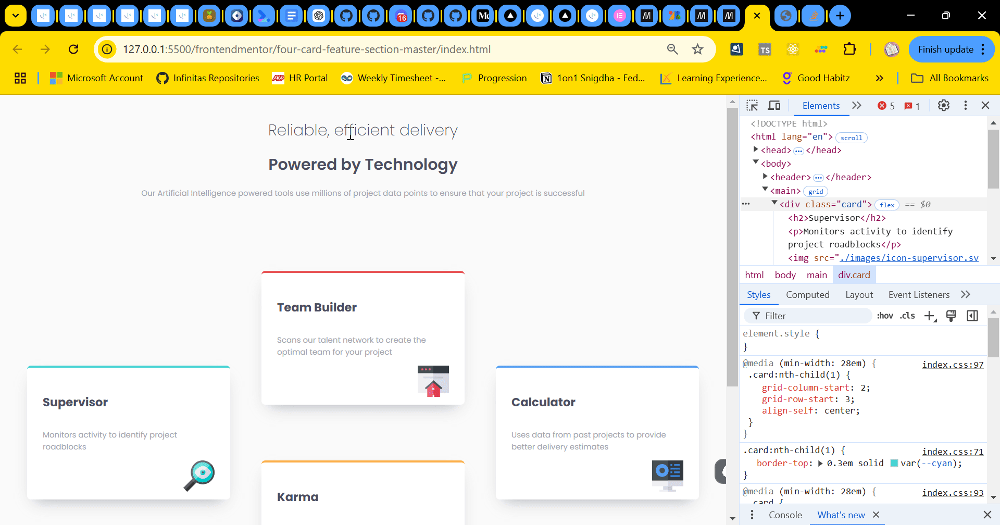

# Frontend Mentor - Four card feature section solution

This is a solution to the [Four card feature section challenge on Frontend Mentor](https://www.frontendmentor.io/challenges/four-card-feature-section-weK1eFYK).

## Table of contents

- [Overview](#overview)
  - [The challenge](#the-challenge)
  - [Screenshot](#screenshot)
  - [Links](#links)
- [My process](#my-process)
  - [Built with](#built-with)
  - [What I learned](#what-i-learned)
  - [Continued development](#continued-development)
  - [Useful resources](#useful-resources)
- [Author](#author)

## Overview

### The challenge

Users should be able to:

- View the optimal layout for the site depending on their device's screen size

### Screenshot



### Links

- Solution URL: [Github link](https://github.com/snigdha-sukun/four-card-feature-section)
- Live Site URL: [Four card feature section](https://four-card-feature-section-iota-henna.vercel.app/)

## My process

### Built with

- Semantic HTML5 markup
- CSS
- Flexbox
- CSS Grid

### What I learned

I learned how to use `:nth-child()` to style each class element individually:

```css
.card:nth-child(1) {
    border-top: 0.3em solid var(--cyan);
}

.card:nth-child(2) {
    border-top: 0.3em solid var(--red);
}

.card:nth-child(3) {
    border-top: 0.3em solid var(--orange);
}

.card:nth-child(4) {
    border-top: 0.3em solid var(--blue);
}
```

I learned how to use CSS Grid to create layout.

```css
main {
    display: grid;
}

@media (min-width: 28em) {
    main {
        grid-template-columns: repeat(5, 1fr);
        grid-template-rows: 5% 35% 5% 35% 5%;
    }

    .card {
        width: 22em;
    }

    .card:nth-child(1) {
    grid-column-start: 2;
    grid-row-start: 3;
    align-self: center;
}

 .card:nth-child(2) {
    grid-column-start: 3;
    grid-row-start: 2;
    align-self: end;
}
.card:nth-child(3) {
    grid-column-start: 3;
    grid-row-start: 4;
    align-self: start;
}
.card:nth-child(4) {
    grid-column-start: 4;
    grid-row-start: 3;
    align-self: center;
}
}
```

### Continued development

I still need to practice the positioning an element & `@media`. I also need to learn about responsive CSS in general & HTML5 rules.

### Useful resources

- [Example resource 1](https://www.example.com) - This helped me for XYZ reason. I really liked this pattern and will use it going forward.
- [Example resource 2](https://www.example.com) - This is an amazing article which helped me finally understand XYZ. I'd recommend it to anyone still learning this concept.

## Author

- Frontend Mentor - [@snigdha-sukun](https://www.frontendmentor.io/profile/snigdha-sukun)
